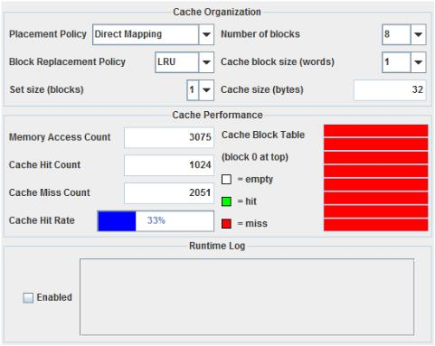
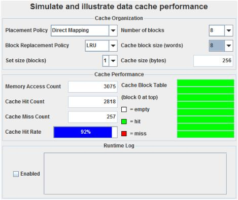
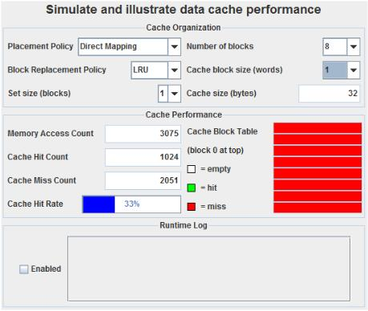
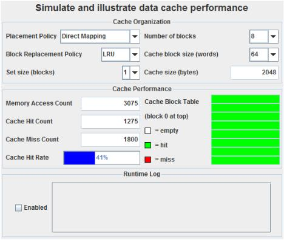

# Locality-based cache hit rate
I looked at how cache hit rates are different when one array is referenced by a column (i) and a row (j).  

# Result
* row_based.asm  
Worst hit rate : 33%  
Best hit rate : 92%  

* column_based.asm  
Worst hit rate : 33%  
Best hit rate : 42%  

